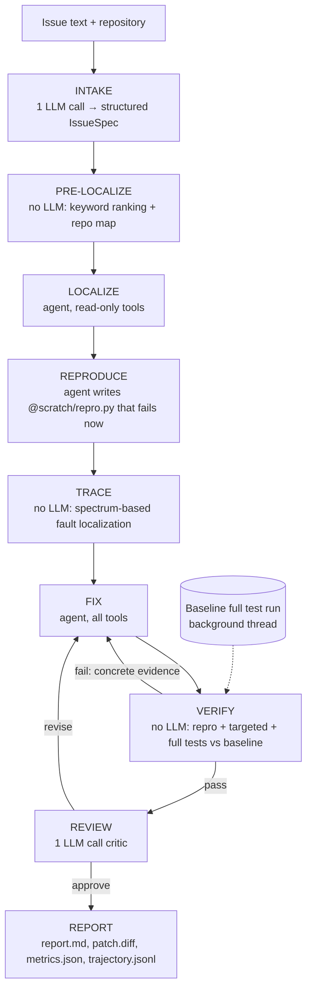

# AI Coding Harness

An autonomous coding-agent harness that takes a GitHub issue and a repository, and returns a **minimal, verified
fix**. It reproduces the bug, localizes it with execution evidence, fixes it, and proves the fix with tests.
Every claim in its report is backed by a run that the harness itself executed.

Built for the LCC × DevClub AI Coding Harness Hackathon 2026.

## Quickstart

```bash
git clone <this repo> && cd ai-harness-evaluator
export AI_API_KEY="<PROVIDED_API_KEY>"
make setup     # creates .venv and installs pinned dependencies (needs Python 3.10–3.14, git, make)
make run       # launches the harness; it then asks for the target repository and the issue
make test      # optional: our offline test suite (no API key needed)
```

Other targets: `make ping` (one tiny request, to check the key and model), `make demo` (fixes a bundled sample
issue on a copy of `fixtures/sample_repo`), `make eval` (benchmark on all bundled issues), `make clean`.

## Supplying the repository and the issue

| How | Example |
| --- | --- |
| Interactive (default) | `make run`: enter a local path or git URL, then paste the issue and end with a line containing only `END` (or Ctrl-D) |
| Make variables | `make run REPO=/path/to/repo ISSUE_FILE=issue.md` |
| Piped issue | `cat issue.md \| .venv/bin/python -m harness --repo /path/to/repo` |
| Flags | `.venv/bin/python -m harness --repo <path\|git URL> --issue "..."` or `--issue-file issue.md` |

A git URL (`https://…`, `git@…`, `….git`) is cloned with `--depth 50` into a workspace outside this project.
An issue that is only a GitHub issue URL is fetched through the GitHub API (title and body). In interactive
mode the harness offers to solve another issue in the same repository afterwards. The fix is left as
uncommitted changes in the target repository.

Exit codes: `0` after any completed run (the result is in the report). With `--strict-exit`: `0` verified,
`2` unverified or no fix, `1` error. `130` on Ctrl-C, after writing a partial report.

## Architecture



Up to three FIX attempts, each fed with the previous attempt's evidence, then one clean-slate rescue attempt.
The best attempt is kept; if every attempt made things worse, all changes are reverted.

| Module | Role |
| --- | --- |
| `harness/orchestrator.py` | phase state machine, budgets, attempts, rescue |
| `harness/agent.py` | one phase of tool-using conversation (loop detection, forced finish, protocol-failure limit) |
| `harness/llm.py` | LiteLLM client: tool-mode probe, retries honouring provider hints, reasoning stripping |
| `harness/tools/` | `list_dir`, `find_files`, `search_code`, `view_file`, `repo_map`, `str_replace`, `create_file`, `run_command`, `run_tests` |
| `harness/workspace.py` | path safety, `@scratch/`, edit history, diff, revert, snapshots |
| `harness/testing.py` | test-framework detection, runs, parsing, before/after comparison |
| `harness/spectrum.py`, `harness/_trace_runner.py` | the Tracer (execution-based fault localization) |
| `harness/report.py`, `harness/ui.py` | evidence report and terminal UI |

## Key engineering decisions

1. **Code does the plumbing; the LLM does the judgment.** File ranking, test detection, running tests,
   before/after comparison, fault localization and the report are deterministic Python. They cost zero tokens
   and cannot hallucinate; the report's efficiency table shows `prelocalize`, `trace` and `verify` at 0 tokens.
2. **A phased state machine with a fresh, small context per phase.** Each phase starts from a compact task built
   from the run state, not from the whole chat. Older tool output is elided once the history nears the
   context budget, and tool-call/result pairs are never broken.
3. **Sharp tools.** `view_file` shows line numbers and pages 250 lines at a time. `str_replace` needs a unique
   match; on a miss it shows the most similar regions. A syntax guard refuses edits that would break a file
   that parsed before. Outputs are truncated keeping head and tail. Dangerous commands (`sudo`, `rm -rf /`,
   `git push`, `sed -i`, …) are blocked, and a third identical call without progress is refused. Existing tests
   cannot be modified, only extended.
4. **Evidence by construction.** The harness runs the reproduction before and after the fix, runs the related
   tests and the full suite before and after, and compares them. Tests that were already failing at baseline
   are never counted as new failures, and are labelled as such when the agent runs tests.
5. **Recovery everywhere.** Retries honour the provider's "try again in N s" hints; daily or quota limits stop
   the run cleanly and still verify and report the current changes; tool calls the provider rejects become
   feedback for the model; unparseable replies end a phase after three in a row instead of burning budget.
   A run always ends with a report and never leaves the repository worse than it found it.
6. **Provider-agnostic.** LiteLLM reaches any provider. A one-time probe decides between native tool calling
   and our text tool protocol (a ```` ```tool ```` JSON block), which is a first-class path for models whose
   native tool calling is unreliable. Chain-of-thought (`<think>` blocks or `reasoning_content`) is logged but
   never sent back. Parameters an endpoint rejects (`seed`, `temperature`, `tool_choice`) are dropped once.
   Context budgets derive from the model's context window.

### Execution-based fault localization (Tracer)

`REPRODUCE → TRACE → FIX`

After the harness has a reproduction that fails, it runs that reproduction and the related passing tests under
a standard-library line tracer (`harness/_trace_runner.py`, inside the target repository's own Python) and ranks
every executed line by Ochiai suspiciousness, `ef / sqrt(nf · (ef + ep))`: lines the failing run executes but
passing tests rarely do score highest. The FIX agent gets the top suspicious functions, with source context, as
evidence. This costs **zero tokens**. On the bundled inventory bug it ranks `Inventory.remove` first in about
0.2 s, and in a live run the final patch touched the rank-#1 function.

It narrows the search; it does not prove anything. The defect can be a *missing* line or a caller of the flagged
code, and the prompt says so. With too few passing tests to contrast against, it reports no ranking instead of a
list of ties. It is purely additive: in a non-Python repository, with no reproduction, on a timeout or a crash,
the run continues unchanged and the report records why the Tracer was skipped. `HARNESS_SPECTRUM=0` disables it.
The with/without comparison (`make eval EVAL_ARGS="--ablation"`) is pending a full benchmark run.

## Evidence produced per run

Every run writes `runs/<timestamp>-<issue words>/`:

| File | Content |
| --- | --- |
| `report.md` | status (✅ VERIFIED FIX / ⚠️ UNVERIFIED CHANGE / ❌ NO FIX / ⛔ ERROR), root cause, an evidence table (reproduction exit codes before → after, targeted and full test suite before → after, new failures, fixed tests, review verdict), the Tracer's fault-localization table, an efficiency table per phase, and the patch |
| `patch.diff` | the change, as a unified diff that `git apply` accepts |
| `metrics.json` | LLM calls, prompt/completion tokens, tool calls and seconds, per phase and in total |
| `state.json` | the full run state (issue, localization, reproduction, attempts, verification, review, Tracer) |
| `trajectory.jsonl` | every model call, tool call and result, retry and phase transition; the API key is redacted |

## Efficiency measures

- Zero-token phases: PRE-LOCALIZE, TRACE, VERIFY and REPORT.
- Compact text-mode tool instructions, one line per tool (292–436 tokens per call instead of 549–812).
- History compaction above a working budget derived from the model's context window; all tool output capped.
- Per-phase step budgets with a "3 calls left" warning and a forced `finish`; loop detection.
- `python` and `python3` shims in `run_command`, so the model's first command works on systems without `python`.
- `run_tests` labels pre-existing failures, so the agent does not chase unrelated broken tests.

## Configuration

Everything that affects output lives in `config.yaml`. The model is `model.name` in LiteLLM format
(`<provider>/<model>`); ready-to-use profiles for DeepSeek, Qwen (DashScope, Groq) and any OpenAI-compatible
endpoint are at the top of the file. Changing the prescribed model is a config edit, never a code edit.

- **API key:** read only from the `AI_API_KEY` environment variable. It is never written to any file, never
  logged (it is redacted from every trajectory line), and never passed to the target repository's processes.
  `.env.example` contains only `AI_API_KEY=`.
- **Tool mode:** `model.tool_mode: auto` probes the endpoint once. `model.force_text_mode_for` lists model-name
  substrings that always use the text protocol; it contains `qwen3`, because Groq's native tool calling for
  `qwen/qwen3.8-27b` proved unreliable in live probing.
- **Determinism:** `temperature: 0.0` and `seed: 42`. When an endpoint rejects `seed`, `temperature` or
  `tool_choice`, the harness drops that parameter for the rest of the run and records it in the run's
  `trajectory.jsonl` (`llm_param_dropped`). **If `seed` is unsupported, `temperature: 0.0` alone is our
  reproducibility claim**, and provider-side sampling may still vary slightly between runs.
- **Budgets:** `budgets.max_total_tokens`, `max_llm_calls` and `max_wall_clock_s` per issue; per-phase step
  limits and fix attempts under `phases`; the Tracer under `spectrum`.

## Results

`make eval` runs the harness on each bundled issue in a fresh copy of `fixtures/sample_repo`, then grades the
result with a hidden test the harness never sees. `make eval EVAL_ARGS="--ablation"` compares runs with and
without the Tracer.

Live results so far (`groq/qwen/qwen3.8-27b` on Groq's free tier; these runs predate the token and rate-limit
improvements described above, and a full re-run is pending):

| Issue | Hidden test | Tokens | LLM calls | Seconds |
| --- | :---: | ---: | ---: | ---: |
| 01 slugify | ✅ | 30,720 | 18 | 206 |
| 02 paginate | ✅ | 34,074 | 19 | 268 |
| 03 durations | ❌ (stopped by the provider's rate limit) | 18,476 | 10 | 275 |
| 04 inventory | ✅ | 34,363 | 18 | 418 |
| 05 median | ✅ | 32,069 | 18 | 259 |

Most of the wall-clock time was spent waiting out the free tier's 1,000-output-tokens-per-minute limit.

## Limitations

- The Tracer works on Python repositories only; other languages still get the full pipeline without it.
- Test-framework detection covers pytest, unittest, npm, Go, Cargo, Maven, Gradle and `make test`, but only
  pytest and unittest results are parsed per test; other frameworks are judged by exit code.
- The harness trusts the target repository's own test suite. If a bug has no reproducible symptom and no tests
  cover it, a fix can only be reported as unverified.
- On rate-limited free tiers (for example Groq's 200,000 tokens per day), a benchmark run can exhaust the daily
  allowance; the harness then stops cleanly and reports what it verified.

## Development

- `make test` runs the offline test suite (about 450 tests, about 30 seconds); model calls are scripted with
  `FakeLLM`, so no API key is needed.
- `NOTES.md` logs every design decision and deviation from the build plan, with the reason.

## Team

(add team member names)
